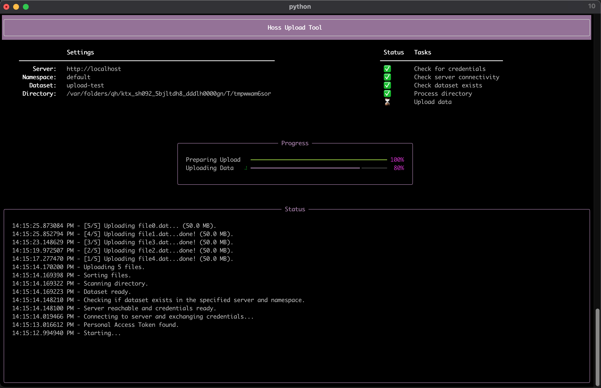

# Command Line Interface
A simple command line interface is installed when you install the client library.

The CLI is available via the `hoss` command.
```
% hoss -h
Usage: hoss [OPTIONS] COMMAND [ARGS]...

  A Command Line Interface to interact with a Hoss server.

Options:
  -h, --help  Show this message and exit.

Commands:
  download  Download files to a local directory from a prefix in a Dataset
  upload    Upload files in a directory to an existing dataset
  version   Print client library and server version info
```

## Upload Tool
The tool will upload a directory into a dataset with some options as shown below.

```
% hoss upload -h
Usage: hoss upload [OPTIONS] DATASET_NAME DIRECTORY

  Upload files in a directory to an existing dataset

Options:
  -n, --namespace TEXT            Namespace that contains the dataset
                                  [default: default]
  -e, --endpoint TEXT             Hoss server root endpoint  [default:
                                  http://localhost]
  -p, --prefix TEXT               Optional prefix to where the files should be
                                  uploaded. If this is not provided, the files
                                  will be uploaded to a 'directory' in the
                                  root of the dataset. The the 'directory'
                                  name will be the same as the source
                                  directory name.
  -s, --skip TEXT                 Optional regular expression used to filter
                                  out files to skip (e.g. myprefix.*\.txt)
  -j, --num_processes INTEGER     Number of processes to use when uploading
                                  files. If you have too many processes you'll
                                  run out of bandwidth and uploads will
                                  timeout/fail. If you don't have enough, your
                                  upload could take more time. In general, if
                                  you have lots of small files you benefit
                                  from more processes, and if you have large
                                  files, you likely don't need that many
                                  because boto will use concurrent uploads
                                  [default: 1]
  -c, --max_concurrency INTEGER   Maximum number of concurrent s3 API transfer
                                  operations.  [default: 10]
  --multipart_threshold INTEGER   Threshold in megabytes for which transfers
                                  will be split into multiple parts, defaults
                                  to 32MB  [default: 32]
  --multipart_chunk_size INTEGER  Size in megabytes for each multipart chunk,
                                  if used. Defaults to 32MB  [default: 32]
  -m, --metadata TEXT             Object metadata key-value pair(s) applied to
                                  every object uploaded. You may specify
                                  multiple values by repeating the option
                                  (e.g. -m foo=bar -m fizz=buzz
  -h, --help                      Show this message and exit.
```

Before running the tool, make sure you set the `HOSS_PAT` env var to a valid PAT, e.g.

```
export HOSS_PAT=hp_abcdef1234567890
```

Then you can simply call `hoss upload -e <server url> <dataset name> <directory> `. The image below shows the 
user interface for a test upload using a temporary directory of test data writing to
the Hoss running on localhost. 



If you have many small files or large network bandwidth you'll likely benefit from increasing `num_processes`. Some 
experimentation may be needed to find an optimal value depending on your data, processing power, and network
bandwidth.

The tool is also available via the {py:class}`hoss.tools.upload.upload_directory` function 
and can be used directly in a Jupyter Notebook.


## Download Tool
The tool will download a prefix within a Dataset (notionally a "folder") to a local directory.

```
% hoss download -h
Usage: hoss download [OPTIONS] DATASET NAMESPACE PREFIX DESTINATION

  Download files to a local directory from a prefix in a Dataset

  DATASET is the name of the dataset from which to download data

  NAMESPACE is the name of the namespace that contains the Dataset

  PREFIX is the prefix inside the dataset to download. Use "/" to indicate the
  root of the dataset.

  DESTINATION is the local directory to write files to

Options:
  -e, --endpoint TEXT            Hoss server root endpoint  [default:
                                 http://localhost]
  -r, --recursive                If set, download all files with the prefix.
                                 Otherwise, only download files at the same
                                 level as the prefix, assuming a `/` delimiter
                                 in the keys to represent 'directories'
                                 [default: False]
  -c, --max_concurrency INTEGER  max concurrency used when analyzing the
                                 prefix via requests to the object store
                                 [default: 10]
  -j, --num_processes INTEGER    Number of processes to use when downloading
                                 files. If you have too many processes you'll
                                 run out of bandwidth and downloads will
                                 timeout/fail. If you don't have enough, your
                                 download could take more time. In general, if
                                 you have lots of small files you benefit from
                                 more processes, and if you have large files,
                                 you likely don't need that many  [default: 1]
  -h, --help                     Show this message and exit.
```

Before running the tool, make sure you set the `HOSS_PAT` env var to a valid PAT, e.g.

```
export HOSS_PAT=hp_abcdef1234567890
```

Then you can call `hoss download -e <server url> <dataset name> <namespace name> <prefix> <directory>`.

To download from the root of a dataset, use `/` for the `prefix`. To download all files in a dataset, you would use
`/` for the `prefix` and the `-r` flag to recursively fetch all data. 

If you have many small files or large network bandwidth you'll likely benefit from increasing `num_processes`. Some 
experimentation may be needed to find an optimal value depending on your data, processing power, and network
bandwidth.

The tool is also available via the {py:class}`hoss.tools.download.download_prefix` function 
and can be used directly in a Jupyter Notebook.
